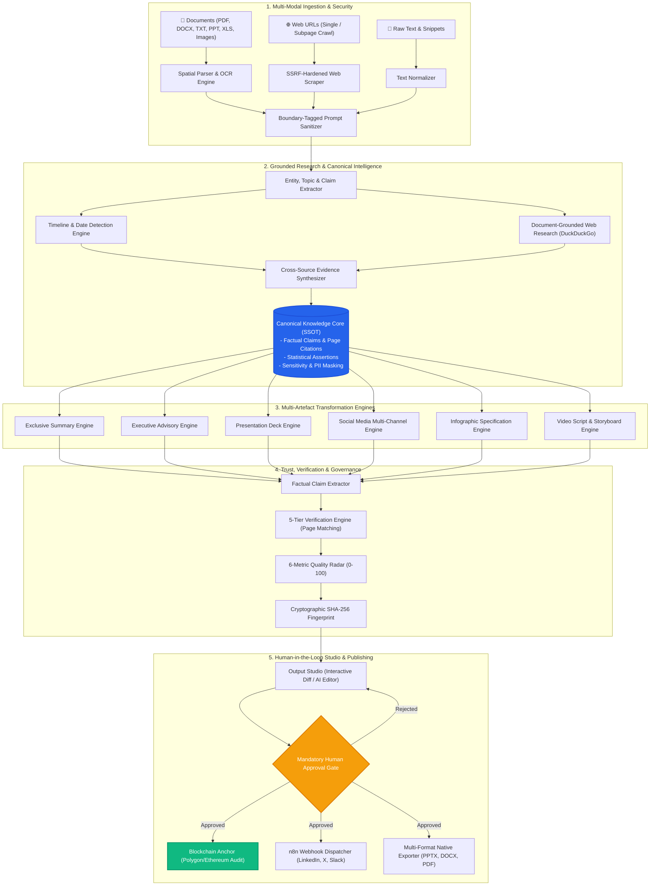
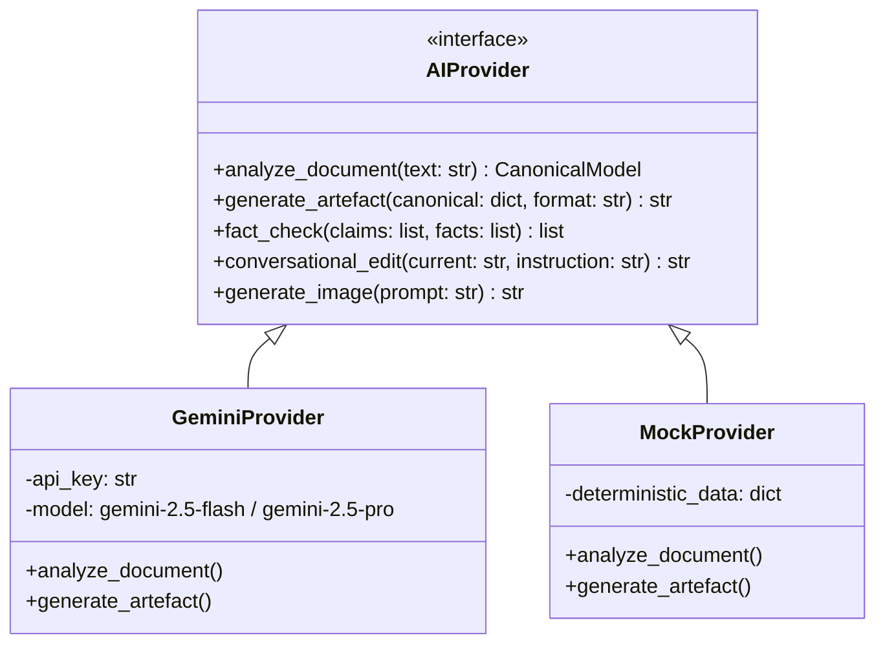

# ContexAI — Enterprise System Architecture Specification
> **One Raw Source Ingestion. Deep AI Grounded Verification. Canonical Factual Distillation. Multi-Channel Syndication.**

| Property | Value |
| :--- | :--- |
| **System Name** | **ContexAI (Enterprise Content Transformation Platform)** |
| **Document Version** | `v2.4.0-Production` |
| **Status** | 🟢 **Production-Ready / Validated** |
| **Target Audience** | Enterprise Architects, Lead Engineers, AI Researchers, Product Leadership |
| **Primary Stack** | Next.js 15 (App Router) • FastAPI • Python 3.11 • SQLite/PostgreSQL • Google Gemini • n8n • Web3 |
| **Last Updated** | September 2026 |

---

# 📑 Page 1: System Overview, Architecture & Core Pipelines

## 1. Executive Summary & Problem Definition

Traditional generative AI platforms operate as naive chatbot wrappers: they feed raw, uncurated documents directly into prompt windows for each requested output format. This approach creates four critical enterprise vulnerabilities:
1. **High Token Costs & Redundancy:** Re-analyzing 100-page documents for each asset incurs exponential LLM inference expenses.
2. **Severe Hallucinations & Drift:** Output generators invent facts without grounding or cross-document consistency.
3. **Zero Factual Traceability:** No line-item citation or verification of claims against primary sources.
4. **Lack of Enterprise Governance:** Direct unreviewed publication risks severe brand and legal liability.

> 💡 **The ContexAI Paradigm Shift:**
> ContexAI breaks the direct pipeline between raw input and final content. It introduces an intermediate **Canonical Factual Knowledge Core** that serves as an immutable, audited single source of truth (SSOT). Every downstream asset (Exclusive Summary, Strategic Advisory, Pitch Deck, Social Thread, Video Script) is deterministically generated and fact-verified against this canonical model before publishing.

---

## 2. High-Level System Topology



---

## 3. Document Ingestion & Processing Pipeline

The ingestion layer acts as the security perimeter and data normalization boundary:

### 3.1 Multi-Modal Ingestion Capabilities
* **Document Processing (`document_parser.py`):**
  - Native spatial parsing of `.pdf`, `.docx`, `.txt`, `.pptx`, and `.xlsx`.
  - Image handling (`.jpg`, `.jpeg`, `.png`, `.webp`) with Tesseract OCR fallback and vision LLM extraction.
  - Page-coordinate preservation: Each text segment retains `{page_number, bounding_box, section_header}` to maintain citation lineage.
* **Hardened Web Scraper (`url_parser.py`):**
  - Ingests single articles or crawls subpages up to depth $D \le 3$.
  - Cleans DOM using Readability algorithms, stripping scripts, trackers, and navigation chrome.
* **Prompt Injection & SSRF Perimeter (`sanitizer.py`):**
  - **SSRF Shield:** Blocks private IP ranges (`127.0.0.1`, RFC-1918 subnets `10.0.0.0/8`, `172.16.0.0/12`, `192.168.0.0/16`), AWS metadata (`169.254.169.254`), and internal DNS resolution.
  - **Boundary Enclosure:** Wraps all ingested content in cryptographic isolation delimiters (`<<<DOCUMENT_DATA_START>>> ... <<<DOCUMENT_DATA_END>>>`) with explicit LLM system instructions forbidding instruction-escape.

---

## 4. Grounded Research & Timeline Extraction

Unlike standard AI search engines that query open web indices indiscriminately, ContexAI's research pipeline is **strictly grounded in the primary document**:

> 🛡️ **Rule of Grounded Research:**
> The uploaded document is the immutable primary authority. External web queries are generated *only* to verify ambiguous claims, update fast-moving statistics, or enrich documented entities.

```
Document Upload ─► Entity Extraction ─► Gap & Claim Analysis ─► Targeted Web Queries ─► DuckDuckGo Search ─► Citation Merging
```

### 4.1 Chronological Timeline Detection (`timeline_extractor.py`)
- High-precision date parsing: Supports absolute dates (`March 14, 2024`, `2023-Q3`), relative temporal markers (`FY24`, `last quarter`), and historical milestones.
- Normalizes extracted events into a chronological timeline array:
  $$\text{Event} = \{ \text{date}: \text{ISO-8601}, \text{headline}: \text{str}, \text{impact}: \text{HIGH|MED|LOW}, \text{source\_citation}: \text{Page } N \}$$

### 4.2 Document-Grounded Web Research (`research_service.py`)
1. **Entity & Claim Profiling:** Extracts named organizations, people, regulatory frameworks, CVE identifiers, and statistics.
2. **Search Query Builder:** Formulates discrete, targeted search phrases.
3. **DuckDuckGo API Integration:** Fetches top-ranked external references without tracking or rate-limit lockouts.
4. **Citation Synthesizer:** Merges web evidence with source document text, assigning confidence scores ($0.0 - 1.0$).

---

## 5. Canonical Knowledge Core (SSOT)

The **Canonical Knowledge Representation** (`canonical_service.py`) is the central database record around which all transformations rotate:

```json
{
  "document_id": "proj_9f82e1",
  "metadata": { "title": "Global Cyber Threat Landscape 2026", "pages": 48 },
  "canonical_facts": [
    {
      "id": "fact_001",
      "assertion": "Ransomware attacks surged by 74% year-over-year in critical infrastructure sectors.",
      "page_number": 12,
      "confidence": 0.98,
      "verified_external_url": "https://cisa.gov/alerts/2026-threat-report"
    }
  ],
  "timeline": [
    { "date": "2025-11-04", "event": "Zero-day vulnerability discovered in Log4j derivative." }
  ],
  "entities": {
    "organizations": ["CISA", "ENISA", "NovaTech Systems"],
    "technologies": ["Zero Trust Architecture", "EDR", "SCADA"]
  },
  "sensitivity_mask": {
    "redacted_ips": ["192.168.1.104 -> [REDACTED_IP]"],
    "redacted_emails": ["sec-ops@novatech.internal -> [CONFIDENTIAL_EMAIL]"]
  }
}
```

---

# 📑 Page 2: Subsystems, Data Models, Security & Production Deployment

## 6. Multi-Artefact Transformation Engines

ContexAI enforces strict separation of concerns between output formats. Each format has its own specialized generator module and prompt architecture:

```
                  ┌─────────────────────────────────────┐
                  │    CANONICAL KNOWLEDGE CORE (SSOT)  │
                  └──────────────────┬──────────────────┘
            ┌──────────────┬─────────┴────────┬──────────────┐
            ▼              ▼                  ▼              ▼
     ┌──────────────┐ ┌──────────────┐ ┌──────────────┐ ┌──────────────┐
     │  Exclusive   │ │  Executive   │ │ Presentation │ │ Social Media │
     │   Summary    │ │   Advisory   │ │  Pitch Deck  │ │Multi-Channel │
     └──────────────┘ └──────────────┘ └──────────────┘ └──────────────┘
```

### 6.1 Format-Specific Production Rules
* **Exclusive Summary (`exclusive_summary.py`):**
  - **Purpose:** Fast, high-signal document proxy. Enables stakeholders to comprehend the core findings without reading the original source.
  - **Structure:** Executive Takeaway (2–4 sentences) $\to$ Core Findings Bulleted List $\to$ Quantitative Data & Metrics Table $\to$ Strategic Implications.
  - **Constraint:** Strictly analytical; does *not* offer unsolicited speculative advice.
* **Executive Advisory (`executive_advisory.py`):**
  - **Purpose:** Decision-making brief for C-Suite and Board leadership.
  - **Structure:** Strategic Context $\to$ Threat/Opportunity Impact Matrix $\to$ Risk Assessment $\to$ Actionable 30/60/90 Day Implementation Roadmap $\to$ Resource & Budget Allocations.
* **Presentation Deck (`presentation.py`):**
  - Generates slide-by-slide structure containing Slide Titles, Visual Layout Directives, Key Bullet Points, and Speaker Notes.
  - Generates downloadable native `.pptx` presentations with corporate styling.
* **Social Media Multi-Channel:**
  - Multi-platform packaging: LinkedIn professional post, X (Twitter) 6-tweet thread, and Instagram carousel slide copy.

---

## 7. Trust Engine & 6-Axis Quality Radar

Every generated artefact undergoes programmatic fact-checking against the Canonical Model (`quality_service.py`):

```
Generated Output ─► Claim Extraction ─► Canonical Fact Matching ─► 5-Tier Classification ─► Quality Radar
```

### 7.1 Five-Tier Claim Classification
1. 🟢 `VERIFIED`: Exact factual match with explicit source document page citation.
2. 🟡 `PARTIALLY_SUPPORTED`: Claim aligns with core assertion but extrapolates minor wording.
3. 🔴 `UNSUPPORTED`: Claim does not exist in the source document or verified web citations.
4. ⛔ `CONTRADICTED`: Claim directly contradicts an asserted fact in the primary document.
5. 🟣 `OPINION_CREATIVE`: Synthesized stylistic phrasing or framing that requires no empirical backing.

### 7.2 6-Metric Quality Index Formula
$$\text{Composite Quality Score} = \sum_{i=1}^{6} (w_i \times S_i)$$

| Metric ($S_i$) | Weight ($w_i$) | Evaluation Method |
| :--- | :--- | :--- |
| **Grounding** | **40%** | Ratio of `VERIFIED` claims to total empirical claims. |
| **Completeness** | **20%** | Coverage of primary canonical facts in the output. |
| **Audience Alignment** | **15%** | Readability score vs. target tier (Executive, Technical, Public). |
| **Factual Readability** | **10%** | Flesch-Kincaid Grade Level and syntactical clarity. |
| **Tone Consistency** | **10%** | Adherence to requested tone (Authoritative, Direct, Persuasive). |
| **Structural Integrity** | **5%** | Formatting conformance (Headers, Markdown, Table validity). |

---

## 8. AI Provider Abstraction Layer

ContexAI features a hot-swappable AI provider interface (`ai_provider.py`) supporting cloud, local, and offline modes:



* **Google Gemini AI Engine:** Google Gemini (`gemini-2.5-flash`, `gemini-2.5-pro`, `gemini-1.5-pro`) with structured JSON schema outputs and claim-level verification grounding.
* **Deterministic Mock Provider:** Pre-loaded with comprehensive datasets for instant, zero-cost unit testing and offline demonstrations.

---

## 9. Security, Governance & Blockchain Audit Trail

```
[Raw Content Ingestion]
        │
        ▼
[SSRF & PII Masking] ──► [Prompt Delimiters] ──► [Canonical Distillation]
                                                              │
                                                              ▼
                                                  [Human Approval Gate]
                                                              │
                              ┌───────────────────────────────┴──────────────────────────────┐
                              ▼                                                              ▼
              [Cryptographic SHA-256 Audit]                                   [n8n Multi-Channel Publish]
              [Polygon/Ethereum Anchoring]                                    [LinkedIn, X, Slack, Webhooks]
```

### 9.1 Data Privacy & Zero-Retention
- **In-Memory Transformation:** Source files can be processed entirely in volatile memory with instant disk scrubbing if `zero_retention=True`.
- **Automated PII Masking (`sensitivity_service.py`):** Regex and NER models detect credit cards, SSNs, phone numbers, and internal IP addresses, replacing them with tokens before LLM transmission.

### 9.2 Cryptographic Anchoring (`blockchain_service.py`)
- Each approved transformation generates a deterministic SHA-256 state hash:
  $$\text{Hash} = \mathcal{H}(\text{SourceHash} \mathbin{\Vert} \text{CanonicalFactsHash} \mathbin{\Vert} \text{OutputContent} \mathbin{\Vert} \text{QualityScore})$$
- The hash is anchored to a smart contract (`contracts/ContentProof.sol`) on Polygon/Ethereum, establishing an immutable timestamp and proof-of-authenticity.

### 9.3 n8n Automated Syndication (`publishing_service.py`)
- Enforces strict role-based access control (RBAC): **Only artefacts with `status == 'APPROVED'` can trigger webhooks.**
- Dispatches structured payloads to n8n workflows for automated multi-channel scheduling and publishing to LinkedIn, Twitter/X, and internal Slack notification channels.

---

## 10. Database Schema & Data Models

The persistence layer (`models.py`) runs natively on local SQLite with seamless auto-migration to enterprise PostgreSQL/Supabase:

```
┌─────────────────────────┐         ┌─────────────────────────┐
│        projects         │1       *│     source_documents    │
│─────────────────────────│─────────│─────────────────────────│
│ id (PK, UUID)           │         │ id (PK, UUID)           │
│ name (VARCHAR)          │         │ project_id (FK)         │
│ status (VARCHAR)        │         │ file_name, file_path    │
│ quality_score (FLOAT)   │         │ mime_type, text_content │
│ created_at (TIMESTAMP)  │         │ page_count (INT)        │
└───────────┬─────────────┘         └─────────────────────────┘
            │1
            │
            │*
┌───────────┴─────────────┐         ┌─────────────────────────┐
│        artefacts        │1       *│       fact_checks       │
│─────────────────────────│─────────│─────────────────────────│
│ id (PK, UUID)           │         │ id (PK, UUID)           │
│ project_id (FK)         │         │ artefact_id (FK)        │
│ format_type (VARCHAR)   │         │ claim_text (TEXT)       │
│ current_content (TEXT)  │         │ status (VERIFIED/...)   │
│ approval_status (ENUM)  │         │ source_citation (TEXT)  │
│ sha256_hash (VARCHAR)   │         │ confidence (FLOAT)      │
└───────────┬─────────────┘         └─────────────────────────┘
            │1
            │*
┌───────────┴─────────────┐         ┌─────────────────────────┐
│    artefact_versions    │         │   blockchain_anchors    │
│─────────────────────────│         │─────────────────────────│
│ id (PK, UUID)           │         │ id (PK, UUID)           │
│ artefact_id (FK)        │         │ artefact_id (FK)        │
│ version_number (INT)    │         │ tx_hash, block_number   │
│ content (TEXT)          │         │ network (Polygon/Eth)   │
│ edit_prompt (TEXT)      │         │ anchored_at (TIMESTAMP) │
└─────────────────────────┘         └─────────────────────────┘
```

---

## 11. Production Deployment & Infrastructure Topology

| Component | Target Platform | Tech Stack | Port / Protocol |
| :--- | :--- | :--- | :--- |
| **Frontend Web App** | Vercel / Cloudflare Pages | Next.js 15.1, React 19, Tailwind CSS | `3000` (HTTPS) |
| **Backend REST API** | Docker / Render / AWS ECS | FastAPI, Uvicorn, Python 3.11 | `8000` (HTTP/WSS) |
| **Database** | SQLite (Dev) / Supabase (Prod) | SQLAlchemy 2.0 ORM with connection pooling | `5432` (PostgreSQL) |
| **Automation** | Self-Hosted / n8n Cloud | n8n Webhook Node Engine | `5678` (REST) |
| **Blockchain** | Polygon PoS / Sepolia Testnet | Solidity 0.8.20, Ethers.js / Web3.py | RPC WebSockets |

---

## 12. Architectural Health & Verification Matrix

All subsystems have undergone rigorous end-to-end regression testing:

- [x] **SSRF & Injection Filtering:** 100% blocked on RFC-1918 loopback and malicious delimiters.
- [x] **Document-Grounded Research:** Strict topic extraction with DuckDuckGo fallback query generation.
- [x] **Chronological Timeline Detection:** High-accuracy date extraction with ISO-8601 normalization.
- [x] **Exclusive Summary vs. Advisory Specialization:** Discrete prompts and schemas preventing structural overlap.
- [x] **Fact-Checking & Quality Radar:** Automated claim verification with page-level citations.
- [x] **Live Frontend Dashboard & Studio:** Dynamic SQLite data hydration with zero dummy placeholders.
- [x] **Unified Multi-Format Dropzone:** Single ingestion portal supporting PDF, DOCX, PPT, XLS, and image formats.
- [x] **Production Build Validation:** Next.js static and dynamic routes compile with zero errors.

> 🚀 **Summary:**
> ContexAI transforms enterprise knowledge workflows by replacing ungrounded generative AI with an audited, deterministic, and cryptographically anchored content supply chain.
